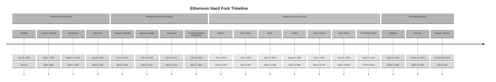

# Ethereum Fork History

This document provides a chronological timeline of Ethereum's network upgrades (hard forks) from genesis to present, including key details and protocol changes.

## Genesis & Early History

### Frontier
- **Date**: July 30, 2015
- **Block**: 0 (Genesis)
- **Description**: The initial version of Ethereum, bare-bones functionality with 5 ETH block rewards. Mining difficulty started extremely low.
- **Key Changes**: Genesis state, basic transaction processing, contract creation, simple EVM

### Frontier Thawing
- **Date**: September 7, 2015
- **Block**: 200,000
- **Description**: Removed the 5,000 gas limit per block, allowing the gas limit to adjust naturally based on demand.

### Homestead
- **Date**: March 14, 2016
- **Block**: 1,150,000
- **Major EIPs**: [EIP-2](https://eips.ethereum.org/EIPS/eip-2), [EIP-7](https://eips.ethereum.org/EIPS/eip-7), [EIP-8](https://eips.ethereum.org/EIPS/eip-8)
- **Description**: The first planned upgrade to the Ethereum network, focusing on security improvements and laying groundwork for future upgrades.
- **Key Changes**: Modified transaction processing, added `DELEGATECALL` opcode, improved networking protocol

### DAO Fork
- **Date**: July 20, 2016
- **Block**: 1,920,000
- **Description**: Controversial hard fork that modified state to recover funds lost in "The DAO" hack. This fork led to the split between Ethereum (ETH) and Ethereum Classic (ETC).
- **Key Changes**: State modification to return DAO funds to a recovery contract

## Metropolis Phase

### Tangerine Whistle (EIP-150)
- **Date**: October 18, 2016
- **Block**: 2,463,000
- **Major EIPs**: [EIP-150](https://eips.ethereum.org/EIPS/eip-150)
- **Description**: Emergency response to DoS attacks on the network in September/October 2016.
- **Key Changes**: Increased gas costs for certain operations, particularly I/O-heavy operations

### Spurious Dragon
- **Date**: November 22, 2016
- **Block**: 2,675,000
- **Major EIPs**: [EIP-155](https://eips.ethereum.org/EIPS/eip-155), [EIP-160](https://eips.ethereum.org/EIPS/eip-160), [EIP-161](https://eips.ethereum.org/EIPS/eip-161), [EIP-170](https://eips.ethereum.org/EIPS/eip-170)
- **Description**: Second response to the DoS attacks, focusing on replay attack protection and state clearing.
- **Key Changes**: Chain ID for transaction signing (replay protection), additional gas cost increases, state clearing (empty accounts), contract code size limit (24KB)

### Byzantium
- **Date**: October 16, 2017
- **Block**: 4,370,000
- **Major EIPs**: [EIP-100](https://eips.ethereum.org/EIPS/eip-100), [EIP-140](https://eips.ethereum.org/EIPS/eip-140), [EIP-196](https://eips.ethereum.org/EIPS/eip-196), [EIP-197](https://eips.ethereum.org/EIPS/eip-197), [EIP-198](https://eips.ethereum.org/EIPS/eip-198), [EIP-211](https://eips.ethereum.org/EIPS/eip-211), [EIP-214](https://eips.ethereum.org/EIPS/eip-214), [EIP-649](https://eips.ethereum.org/EIPS/eip-649), [EIP-658](https://eips.ethereum.org/EIPS/eip-658)
- **Description**: First part of the Metropolis upgrade, adding zk-SNARK support and other improvements.
- **Key Changes**: New cryptographic primitives (elliptic curve operations), `REVERT` opcode, `STATICCALL` opcode, mining reward reduction from 5 to 3 ETH, difficulty bomb delay

### Constantinople + St. Petersburg
- **Date**: February 28, 2019
- **Block**: 7,280,000
- **Major EIPs**: [EIP-145](https://eips.ethereum.org/EIPS/eip-145), [EIP-1014](https://eips.ethereum.org/EIPS/eip-1014), [EIP-1052](https://eips.ethereum.org/EIPS/eip-1052), [EIP-1234](https://eips.ethereum.org/EIPS/eip-1234), [EIP-1283](https://eips.ethereum.org/EIPS/eip-1283) (added then removed)
- **Description**: Second part of Metropolis. Constantinople was delayed due to an issue with EIP-1283, which was removed in the St. Petersburg upgrade that occurred at the same block.
- **Key Changes**: Bitwise shifting operations, CREATE2 opcode for deterministic contract addresses, mining reward reduction from 3 to 2 ETH, difficulty bomb delay

## Serenity Phase

### Istanbul
- **Date**: December 8, 2019
- **Block**: 9,069,000
- **Major EIPs**: [EIP-152](https://eips.ethereum.org/EIPS/eip-152), [EIP-1108](https://eips.ethereum.org/EIPS/eip-1108), [EIP-1344](https://eips.ethereum.org/EIPS/eip-1344), [EIP-1884](https://eips.ethereum.org/EIPS/eip-1884), [EIP-2028](https://eips.ethereum.org/EIPS/eip-2028), [EIP-2200](https://eips.ethereum.org/EIPS/eip-2200)
- **Description**: Focused on gas cost adjustments and addition of new cryptographic primitives.
- **Key Changes**: Added Blake2F precompile, reduced gas costs for zk-SNARK operations, added CHAINID opcode, adjusted gas costs for storage operations, reduced calldata gas costs

### Muir Glacier
- **Date**: January 2, 2020
- **Block**: 9,200,000
- **Major EIPs**: [EIP-2384](https://eips.ethereum.org/EIPS/eip-2384)
- **Description**: Single-purpose fork to delay the difficulty bomb.
- **Key Changes**: Delayed the Ice Age/Difficulty Bomb by 4 million blocks

### Berlin
- **Date**: April 15, 2021
- **Block**: 12,244,000
- **Major EIPs**: [EIP-2565](https://eips.ethereum.org/EIPS/eip-2565), [EIP-2718](https://eips.ethereum.org/EIPS/eip-2718), [EIP-2929](https://eips.ethereum.org/EIPS/eip-2929), [EIP-2930](https://eips.ethereum.org/EIPS/eip-2930)
- **Description**: Gas optimization and transaction envelope standardization.
- **Key Changes**: Introduced transaction type envelope, lower gas cost for ModExp precompile, higher gas costs for state access (mitigating DoS attacks), optional access lists to reduce gas costs

### London
- **Date**: August 5, 2021
- **Block**: 12,965,000
- **Major EIPs**: [EIP-1559](https://eips.ethereum.org/EIPS/eip-1559), [EIP-3198](https://eips.ethereum.org/EIPS/eip-3198), [EIP-3529](https://eips.ethereum.org/EIPS/eip-3529), [EIP-3541](https://eips.ethereum.org/EIPS/eip-3541), [EIP-3554](https://eips.ethereum.org/EIPS/eip-3554)
- **Description**: Introduced a major change to the fee market and prepared for the merge.
- **Key Changes**: Base fee that gets burned, new transaction format with priority fee, BASEFEE opcode, reduced gas refunds, rejected contract code starting with 0xEF

### Arrow Glacier
- **Date**: December 9, 2021
- **Block**: 13,773,000
- **Major EIPs**: [EIP-4345](https://eips.ethereum.org/EIPS/eip-4345)
- **Description**: Another single-purpose fork to push back the difficulty bomb.
- **Key Changes**: Delayed difficulty bomb to June 2022

### Gray Glacier
- **Date**: June 30, 2022
- **Block**: 15,050,000
- **Major EIPs**: [EIP-5133](https://eips.ethereum.org/EIPS/eip-5133)
- **Description**: Final Proof of Work difficulty bomb delay.
- **Key Changes**: Delayed difficulty bomb by 700,000 blocks (~100 days)

### The Merge (Paris)
- **Date**: September 15, 2022
- **Terminal Total Difficulty**: 58,750,000,000,000,000,000,000
- **Major EIPs**: [EIP-3675](https://eips.ethereum.org/EIPS/eip-3675), [EIP-4399](https://eips.ethereum.org/EIPS/eip-4399)
- **Description**: The historical transition from Proof of Work to Proof of Stake consensus.
- **Key Changes**: Removed mining, introduced validator-based block proposal, upgraded consensus model, added PREVRANDAO opcode (replacing DIFFICULTY), reduced block time to ~12 seconds

## Post-Merge Upgrades

### Shanghai + Capella (Shapella)
- **Date**: April 12, 2023
- **Block**: 17,034,870
- **Major EIPs**: [EIP-3651](https://eips.ethereum.org/EIPS/eip-3651), [EIP-3855](https://eips.ethereum.org/EIPS/eip-3855), [EIP-3860](https://eips.ethereum.org/EIPS/eip-3860), [EIP-4895](https://eips.ethereum.org/EIPS/eip-4895)
- **Description**: First upgrade after The Merge, most notably enabling staked ETH withdrawals.
- **Key Changes**: Enabled validator withdrawals, warm COINBASE address, PUSH0 opcode, limited contract initcode to 2^24 bytes

### Cancun + Deneb (Dencun)
- **Date**: March 13, 2024
- **Block**: 19,426,587
- **Major EIPs**: [EIP-1153](https://eips.ethereum.org/EIPS/eip-1153), [EIP-4788](https://eips.ethereum.org/EIPS/eip-4788), [EIP-4844](https://eips.ethereum.org/EIPS/eip-4844), [EIP-5656](https://eips.ethereum.org/EIPS/eip-5656), [EIP-6780](https://eips.ethereum.org/EIPS/eip-6780), [EIP-7516](https://eips.ethereum.org/EIPS/eip-7516)
- **Description**: Introduced blob transactions (proto-danksharding) to significantly reduce costs for rollups.
- **Key Changes**: Blob transactions, transient storage opcodes (TSTORE/TLOAD), parent beacon block root in the EVM, MCOPY opcode, self-destruct changes (deactivation of ETH-returning behavior), blob base fee

## Upcoming Upgrades

### Prague + Electra
- **Expected Date**: Q4 2024 or Q1 2025
- **Major EIPs Under Consideration**: [EIP-4788](https://eips.ethereum.org/EIPS/eip-4788) (partial implementation), [EIP-2537](https://eips.ethereum.org/EIPS/eip-2537), [EIP-7002](https://eips.ethereum.org/EIPS/eip-7002), [EIP-6780](https://eips.ethereum.org/EIPS/eip-6780) (full deprecation), EOF proposals
- **Description**: Expected to introduce EVM Object Format (EOF), further SELF-DESTRUCT deprecation, and additional crypto precompiles.
- **Proposed Changes**: EVM Object Format (EOF), BLS precompiles, additional EVM improvements

## Timeline Chart

## References

- [Ethereum.org: History and Forks](https://ethereum.org/en/history/)
- [Ethereum Foundation Blog](https://blog.ethereum.org)
- [EIPs Website](https://eips.ethereum.org)
- [Ethereum Improvement Proposals Repository](https://github.com/ethereum/EIPs) 