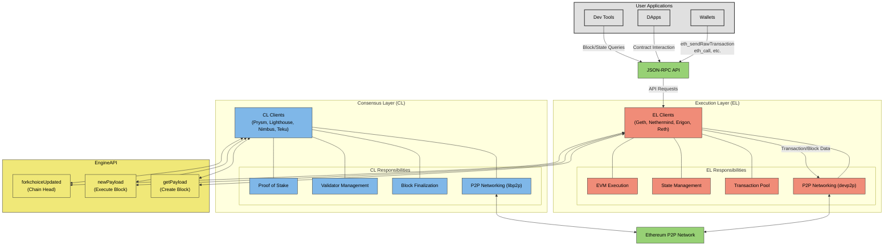

# Track 0: Orientation

## Overview

The journey into Ethereum core development begins with orientation. This track establishes the necessary context for understanding the modern Ethereum architecture, locating essential technical specifications, and setting up your development environment. By the end of this track, you will have a functional development setup and understand where to find the authoritative sources that define Ethereum's behavior.

## Learning Objectives

By the end of this track, you will be able to:
- Understand the distinction between Execution Layer (EL) and Consensus Layer (CL) clients
- Locate and navigate key Ethereum specifications (Yellow Paper, EIPs, etc.)
- Set up a Rust development environment suitable for Ethereum client development
- Run basic Rust code within the course framework

## Core Concepts

### Ethereum Client Architecture

#### The Execution and Consensus Layer Split

Prior to "The Merge" (September 2022), Ethereum operated entirely on a Proof of Work (PoW) consensus mechanism. A single client type handled all aspects of the protocol: transaction processing, state management, consensus, and peer-to-peer networking.

Post-Merge, Ethereum adopted a more modular architecture with two distinct client types:

1. **Execution Layer (EL) Clients:** 
   - Examples: Geth, Nethermind, Erigon, Reth
   - Responsibilities: 
     - Process transactions
     - Maintain the state (accounts, balances, contract code)
     - Execute EVM code
     - Serve JSON-RPC API requests

2. **Consensus Layer (CL) Clients:**
   - Examples: Prysm, Lighthouse, Nimbus, Teku
   - Responsibilities:
     - Implement Proof of Stake consensus
     - Manage validator operations
     - Handle block finalization
     - Coordinate network participation

This separation of concerns allows each layer to evolve more independently while maintaining communication through a standardized interface.

#### Ethereum's Post-Merge Architecture



The diagram above illustrates the current Ethereum architecture after The Merge:

- **User Applications** interact with Ethereum through JSON-RPC APIs
- **Execution Layer (EL)** handles transaction processing, state management, and EVM execution
- **Consensus Layer (CL)** manages consensus through Proof of Stake and validator operations
- Both layers communicate via the **Engine API**, which has specific methods for block proposal and execution
- Both layers connect to the broader Ethereum network through their respective P2P networking stacks

This architecture enables a cleaner separation of concerns while allowing each layer to specialize in its core functions.

### The Merge: Architectural Implications

The Merge fundamentally changed how blocks are produced and validated in Ethereum:

- **Pre-Merge:** Miners competed to solve cryptographic puzzles, winner proposed the next block
- **Post-Merge:** Validators are randomly selected to propose blocks based on staked ETH

For client development, this means:
- EL clients no longer determine the canonical chain (fork choice)
- CL clients direct the EL clients on which blocks to execute
- Communication between layers occurs via a standardized Engine API

This course focuses primarily on EL client development, but understanding the interaction with the CL is crucial.

### Ethereum Specification Landscape

To develop for Ethereum, you must know where to find authoritative specifications. Here are the key resources:

#### Yellow Paper

The [Ethereum Yellow Paper](https://ethereum.github.io/yellowpaper/paper.pdf) is the original formal specification of Ethereum. It describes the blockchain, account model, EVM, gas mechanics, and other core components using mathematical notation. While dense, it remains a valuable reference for precise definitions.

Key sections to understand:
- Section 3: State Machine
- Section 4: Block, State and Transaction
- Section 9: Execution Model
- Appendix G: Fee Schedule
- Appendix H: Virtual Machine Specification

#### Ethereum Improvement Proposals (EIPs)

[EIPs](https://eips.ethereum.org/) document standards for the Ethereum platform, including core protocol specifications, client APIs, and contract standards. They are the primary mechanism for proposing and documenting changes to Ethereum.

Important EIP categories:
- **Core:** Changes to consensus rules
- **Networking:** P2P communication between clients
- **Interface:** Client API/RPC specifications
- **ERC:** Application-level standards

#### Execution Specifications

The [Execution Specs](https://github.com/ethereum/execution-specs) project provides executable Python specifications for EL client behavior. This is increasingly becoming the reference implementation for Ethereum protocol rules.

#### Execution API Specifications

The [Execution APIs](https://github.com/ethereum/execution-apis) repository contains specifications for JSON-RPC methods that EL clients must implement, as well as the Engine API for EL-CL communication.

#### Consensus Specifications

The [Consensus Specs](https://github.com/ethereum/consensus-specs) repository defines the behavior of CL clients, including fork choice rules, validator operations, and networking.

## Development Environment Setup

### Required Tooling

To participate in this course, you'll need:

1. **Rust Toolchain:** The [Rust programming language](https://www.rust-lang.org/) compiler and package manager
2. **System Dependencies:** Libraries required to build Ethereum clients (e.g., RocksDB, OpenSSL)
3. **Git:** For version control and accessing repositories
4. **IDE/Text Editor:** Visual Studio Code, CLion, or any editor with Rust language support

### Setup Instructions

The course provides a bootstrap script that automates the installation of required dependencies:

```bash
# Clone the repository
git clone https://github.com/<you>/evm-zero-to-hero.git
cd evm-zero-to-hero

# Run the setup script
./bootstrap/setup.sh
```

The script performs the following:
1. Installs Rust using rustup (if not already installed)
2. Configures the required Rust toolchain version
3. Installs system dependencies based on your OS
4. Checks that everything is correctly installed

### Sanity Check

To verify that your environment is correctly set up:

```bash
# Run the simple proof example
cargo run -p mpt-play --example simple_proof
```

This will compile and run a basic example that demonstrates Merkle Patricia Tries. If successful, you'll see output showing a trie construction and proof verification.

## Exercise: Environment Setup and Verification

### Objective

Set up your development environment and run a simple test to verify everything is working correctly.

### Tasks

1. **Clone the Repository:**
   ```bash
   git clone https://github.com/<your-username>/evm-zero-to-hero.git
   cd evm-zero-to-hero
   ```

2. **Run the Bootstrap Script:**
   ```bash
   ./bootstrap/setup.sh
   ```
   
   If you encounter any errors, carefully read the output for clues about missing dependencies. Common issues include:
   - Missing system libraries (solution varies by OS)
   - Insufficient permissions (try using sudo)
   - Network connectivity problems

3. **Run the Sanity Check:**
   ```bash
   cargo run -p mpt-play --example simple_proof
   ```
   
   Success looks like:
   ```
   Creating a simple MPT...
   Inserting key-value pairs...
   Generating proof for key "key2"...
   Verifying proof...
   Proof verified successfully!
   ```

4. **Explore the Repository Structure:**
   Familiarize yourself with the organization:
   ```bash
   ls -la
   ```
   
   Key directories:
   - `bootstrap/`: Environment setup scripts
   - `modules/`: The Rust crates for each track's labs
   - `docs/`: Course materials and track guides
   - `capstone/`: Scaffold for your final project

### Expected Outcome

After completing this exercise, you should:
- Have a functional Rust development environment
- Be able to compile and run the course code
- Understand the repository structure

### Troubleshooting

If you encounter issues:

1. **Rust Installation Problems:**
   - Visit [rust-lang.org](https://www.rust-lang.org/tools/install) for manual installation instructions
   - Ensure PATH variables are correctly set

2. **Dependency Issues:**
   - Check error messages for specific missing libraries
   - For Ubuntu/Debian: `apt-get install build-essential pkg-config libssl-dev`
   - For macOS: `brew install openssl`

3. **Compilation Errors:**
   - Ensure you're using the correct Rust version: `rustc --version`
   - Try a clean build: `cargo clean && cargo build -p mpt-play`

## Conclusion

You've now completed the orientation track! You understand the modern Ethereum architecture with its split between Execution and Consensus layers, know where to find the authoritative specifications that define protocol behavior, and have a working development environment.

In the next track, we'll dive into Ethereum fundamentals, exploring accounts, state representation, and the Merkle Patricia Trie data structure in detail.

## Further Reading

- [Ethereum.org - The Merge](https://ethereum.org/en/upgrades/merge/)
- [Ethereum.org - Node Architecture](https://ethereum.org/en/developers/docs/nodes-and-clients/node-architecture/)
- [Tim Beiko's Guide to the Merge](https://blog.ethereum.org/2021/12/02/how-the-merge-impacts-app-layer)
- [Ethereum Execution Layer Specifications](https://github.com/ethereum/execution-specs) 