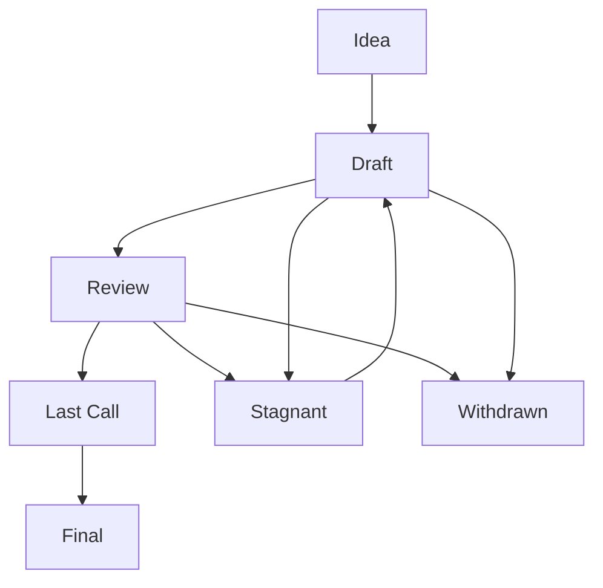

# Track 10: Governance

## Overview

Ethereum's technical evolution is governed through a complex social process balancing decentralization, technical excellence, and community consensus. This track explores the human side of protocol development: how changes are proposed, discussed, refined, and ultimately implemented. You'll learn about the Ethereum Improvement Proposal (EIP) process, the role of various stakeholders in governance, and the norms that guide productive interaction within the Ethereum development community. The hands-on exercise involves drafting a Meta EIP, providing direct experience with the standards and procedures that coordinate the efforts of a global community of core developers.

## Learning Objectives

By the end of this track, you will be able to:
- Understand Ethereum's governance model and the EIP process
- Draft technically precise and well-structured EIPs
- Navigate community discussion forums and governance calls
- Explain the client release cycle and coordination between teams
- Contribute effectively to the Ethereum ecosystem
- Communicate technical ideas clearly to various stakeholders

## Core Concepts

### Ethereum's Governance Model

Ethereum has an informal governance structure that balances decentralization with the need to make technical decisions.

#### Key Stakeholders

1. **Core Developers**: Maintainers of client implementations who make technical decisions
2. **EIP Authors**: Individuals who propose protocol changes
3. **Researchers**: Academics and theorists who explore new designs and solutions
4. **Client Teams**: Groups maintaining specific clients (Geth, Nethermind, Reth, etc.)
5. **Application Developers**: Builders of dApps and other systems on Ethereum
6. **Users and Token Holders**: The broader community who use and hold ETH
7. **Miners/Validators**: Entities securing the network

#### Decision-Making Forums

1. **AllCoreDevs (ACD) Calls**: Biweekly calls where client developers coordinate protocol changes
2. **Ethereum Magicians**: Forum for technical discussion of proposals
3. **Ethereum Research (ethresear.ch)**: Platform for early-stage research ideas
4. **EIPs Repository**: GitHub repository where formal proposals are published
5. **Client-specific Channels**: Each client team has their own communication channels
6. **Protocol Guild**: Group of long-term core protocol contributors
7. **Ethereum Foundation**: Non-profit that supports Ethereum development

#### Governance Principles

1. **Rough Consensus**: Decisions aim for broad agreement rather than unanimous approval
2. **Technical Meritocracy**: Ideas evaluated on technical soundness, not source
3. **Open Participation**: Anyone can propose changes and join discussions
4. **Transparency**: Decision-making happens in public forums
5. **Implementation Neutrality**: Protocol should not favor specific implementations
6. **Backward Compatibility**: Strong preference for non-breaking changes

### The EIP Process

Ethereum Improvement Proposals (EIPs) are the formal mechanism for proposing changes to Ethereum.

#### EIP Types

1. **Standards Track**:
   - **Core**: Changes to consensus rules, requires client implementation
   - **Networking**: Updates to devp2p protocol, block propagation, etc.
   - **Interface**: Application-level standards and conventions
   - **ERC (Ethereum Request for Comments)**: Application-level standards and conventions

2. **Meta EIPs**: Process changes and informational documents
3. **Informational EIPs**: General guidelines and information

#### EIP Statuses

1. **Idea**: Initial discussion phase
2. **Draft**: Formal proposal with complete specification
3. **Review**: Under active review and consideration
4. **Last Call**: Final call for comments before proceeding
5. **Final**: Accepted standard
6. **Stagnant**: Inactive proposals
7. **Withdrawn**: Proposals removed by authors
8. **Living**: Continuously updated standards

#### EIP Workflow



#### EIP Components

1. **Preamble**: Metadata including authors, type, status, and dependencies
2. **Abstract**: Brief, high-level summary of the proposal
3. **Motivation**: Why the change is needed and what problems it solves
4. **Specification**: Precise technical details of the implementation
5. **Rationale**: Justification for design decisions
6. **Backwards Compatibility**: Impact on existing systems
7. **Test Cases**: Examples to verify correct implementation
8. **Reference Implementation**: Example code (where applicable)
9. **Security Considerations**: Analysis of potential vulnerabilities
10. **Copyright Waiver**: Standard license statement

### EIP Authoring Best Practices

Writing an effective EIP requires both technical precision and clear communication.

#### Defining the Problem Scope

1. **Problem isolation**: Focus on a single, well-defined issue
2. **Use cases**: Concrete examples of how the problem affects users
3. **Existing solutions**: Analysis of current approaches and their limitations
4. **Metrics**: Quantifiable measures of the problem's impact

#### Developing the Solution

1. **Iterative refinement**: Start with a basic approach and improve through feedback
2. **Alternative approaches**: Consider and address different solutions
3. **Implementation complexity**: Assess development effort required
4. **Trade-offs**: Explicitly state compromises and design choices

#### Technical Writing

1. **Precision**: Use specific, unambiguous language
2. **Formality**: Mathematical notation when appropriate
3. **Examples**: Concrete illustrations of abstract concepts
4. **Audience awareness**: Write for both experts and informed newcomers
5. **Diagrams**: Visual representations of complex systems

#### Building Consensus

1. **Early feedback**: Share ideas informally before formal submission
2. **Stakeholder engagement**: Identify and involve affected parties
3. **Addressing concerns**: Respond constructively to criticism
4. **Compromise**: Be willing to adjust proposals based on feedback
5. **Patience**: Accept that significant changes take time

### Hard Fork Coordination

Major protocol upgrades in Ethereum are implemented through coordinated hard forks.

#### Fork Coordination Process

1. **Proposal collection**: Identifying EIPs for inclusion
2. **Specification freeze**: Finalizing technical details
3. **Implementation**: Client teams integrating changes
4. **Testing**: Validation on testnets
5. **Deployment**: Coordinated mainnet activation

#### Meta EIPs for Hard Forks

Each hard fork typically has a Meta EIP that:
- Lists included EIPs
- Defines activation parameters
- Coordinates testing requirements
- Documents client support

#### Recent Hard Forks

| Fork Name | Meta EIP | Key Changes | Date |
|-----------|---------|-------------|------|
| Shanghai/Capella | EIP-4895 | Enabling staking withdrawals | April 2023 |
| Paris/Bellatrix | - | The Merge (PoW to PoS) | September 2022 |
| London | EIP-3554 | EIP-1559 fee market | August 2021 |
| Berlin | EIP-2982 | Gas optimizations | April 2021 |
| Istanbul | EIP-1679 | Various improvements | December 2019 |

### Client Release Management

Coordinating software releases across multiple independent client teams is a key aspect of Ethereum governance.

#### Release Cycle

1. **Specification development**: Agreement on EIPs and technical details
2. **Feature branches**: Implementation in client codebases
3. **Internal testing**: Unit and integration testing
4. **Client releases**: Alpha and beta versions for testing
5. **Testnet deployment**: Coordinated testnet forks
6. **Security audits**: Third-party review of implementations
7. **Release candidates**: Final pre-production versions
8. **Mainnet deployment**: Production release

#### Client Diversity Considerations

Different client implementations have:
- Different programming languages (Go, Rust, Java, C#)
- Different performance characteristics
- Different architectural approaches
- Different levels of resources and contributors

This creates challenges for:
- Ensuring consistent behavior
- Maintaining protocol compatibility
- Synchronizing release schedules
- Resolving implementation-specific bugs

#### Version Compatibility

Client versioning typically follows:
1. **Major version**: Protocol-breaking changes
2. **Minor version**: Non-breaking feature additions
3. **Patch version**: Bug fixes and minor improvements

Critical updates may be backported to multiple versions to ensure wide adoption.

### Community Interaction Norms

Effective participation in Ethereum governance requires understanding community culture and expectations.

#### Communication Channels

1. **GitHub**: EIPs repository, client repositories, issue discussions
2. **Ethereum Magicians**: Technical discussion forum
3. **Ethereum Research**: Research discussion forum
4. **Discord/Gitter**: Real-time chat for client teams
5. **AllCoreDevs Calls**: Biweekly video calls (public)
6. **Twitter/Social Media**: Informal discussion and announcements
7. **ETH Conferences**: In-person collaboration and discussion

#### Effective Communication Strategies

1. **Do your homework**: Research extensively before proposing ideas
2. **Start small**: Begin with questions and small contributions
3. **Show, don't tell**: Provide code, proofs, or detailed specifications
4. **Be patient**: Major changes require time for consideration
5. **Separate concerns**: Technical discussions should focus on technical merits
6. **Credit others**: Acknowledge contributions and related work
7. **Accept criticism**: View feedback as improving the proposal, not as personal attacks

#### Common Pitfalls

1. **Scope creep**: Trying to solve too many problems at once
2. **Overconfidence**: Assuming your solution is obviously correct
3. **Appeal to urgency**: Pushing for hasty decisions
4. **Forum shopping**: Seeking approval from different groups when rejected
5. **Excessive advocacy**: Promoting proposals beyond technical discussion
6. **Reinventing the wheel**: Proposing solutions without researching prior work
7. **Focus on personalities**: Emphasizing who rather than what

### Open Source Contribution Workflow

Contributing to Ethereum client codebases follows standard open source practices with some protocol-specific considerations.

#### Contribution Process

1. **Issue identification**: Finding bugs or areas for improvement
2. **Discussion**: Confirming approach on GitHub issues
3. **Forking**: Creating your own copy of the repository
4. **Feature branch**: Creating a dedicated branch for changes
5. **Implementation**: Writing code and tests
6. **Testing**: Ensuring all tests pass
7. **Pull request**: Submitting changes for review
8. **Code review**: Addressing feedback
9. **Merge**: Incorporation into the main codebase
10. **Release**: Inclusion in a future software release

#### Client-Specific Considerations

1. **Consensus-critical code**: Receives extra scrutiny
2. **Protocol compatibility**: Must maintain interoperability
3. **Performance impacts**: Changes may affect node performance
4. **Security implications**: Especially important for client software
5. **Testing requirements**: More extensive than typical projects

#### Contribution Guidelines

Most Ethereum clients have:
- Coding style guidelines
- Required tests
- Documentation standards
- Commit message formats
- Review processes
- Licensing requirements

## Exercise: Drafting a Meta EIP

### Objective

Create a draft Meta EIP that proposes a process improvement or documents information relevant to Ethereum core developers.

### Prerequisites

- Completed Tracks 0-9
- Understanding of the EIP format and process
- Familiarity with Markdown formatting

### Tools and Resources

- EIP-1 (EIP Purpose and Guidelines)
- EIP template
- Markdown editor
- Ethereum Magicians forum

### Tasks

1. **Select a Topic:**

   Choose one of the following Meta EIP topics or propose your own:
   
   a) **Standardizing Deprecation Processes**: Define a formal process for deprecating outdated EIPs or features
   
   b) **Test Case Requirements**: Propose standards for test cases that should accompany Core EIPs
   
   c) **Client Interoperability Testing**: Define a process for ensuring client compatibility before hard forks
   
   d) **EIP Editor Guidelines**: Document best practices for EIP editors reviewing proposals
   
   e) **Custom Topic**: Identify a gap in current processes and propose a solution

2. **Research Existing Practices:**

   Before writing, research current approaches to your chosen topic:
   
   ```bash
   # Clone the EIPs repository
   git clone https://github.com/ethereum/EIPs.git
   cd EIPs
   
   # Search for related EIPs
   grep -r "deprecation" --include="*.md" .
   grep -r "testing" --include="*.md" .
   ```
   
   Also review:
   - Ethereum Magicians discussions
   - AllCoreDevs meeting notes
   - Client team documentation

3. **Create an EIP Draft:**

   Start with the standard template:

   ```markdown
   ---
   eip: <to be assigned>
   title: <The EIP title is a few words, not a complete sentence>
   description: <Description is one complete sentence>
   author: Your Name (@yourgithubname), <your@email.com>
   discussions-to: <URL>
   status: draft
   type: Meta
   created: <date created on, in ISO 8601 (yyyy-mm-dd) format>
   requires: <EIP number(s)>
   ---
   
   ## Abstract
   
   A short (~200 word) description of the issue being addressed.
   
   ## Motivation
   
   The motivation is critical for EIPs that want to change the Ethereum protocol. It should clearly explain why the existing protocol is inadequate to address the problem that the EIP solves.
   
   ## Specification
   
   The technical specification should describe the syntax and semantics of any new feature. The specification should be detailed enough to allow competing, interoperable implementations.
   
   ## Rationale
   
   The rationale fleshes out the specification by describing what motivated the design and why particular design decisions were made.
   
   ## Backwards Compatibility
   
   Meta EIPs do not typically have backward compatibility concerns, but if your proposal affects existing processes, explain the impact here.
   
   ## Security Considerations
   
   Describe any security implications or considerations.
   
   ## Copyright
   
   Copyright and related rights waived via [CC0](../LICENSE.md).
   ```

4. **Complete the Preamble:**

   Fill in the metadata at the top of the EIP:
   
   ```markdown
   ---
   eip: <to be assigned>
   title: Standardized Client Interoperability Testing Process
   description: A formal process for testing client interoperability before hard forks
   author: Your Name (@yourgithubname), <your@email.com>
   discussions-to: <URL of a discussion thread>
   status: draft
   type: Meta
   created: 2023-12-01
   requires: 1
   ---
   ```
   
   Note: The actual EIP number would be assigned when submitted to the repository.

5. **Write the Abstract:**

   Provide a concise summary of your proposal:
   
   ```markdown
   ## Abstract
   
   This EIP proposes a standardized process for testing interoperability between Ethereum clients before hard fork deployments. It defines required testing stages, metrics for determining readiness, and coordination procedures to ensure smoother hard fork transitions. The process includes specific validation points, automated testing frameworks, and documentation requirements to verify that all clients correctly implement consensus changes.
   ```

6. **Explain the Motivation:**

   Clearly state why this change is needed:
   
   ```markdown
   ## Motivation
   
   Recent hard forks have occasionally revealed interoperability issues between clients that were only discovered late in the testing process or after mainnet deployment. These issues can lead to chain splits, degraded network performance, or delayed upgrades. While ad-hoc testing currently occurs, the Ethereum ecosystem lacks a formal, documented process that ensures comprehensive interoperability testing across all client implementations. This EIP aims to standardize these practices, making hard fork coordination more predictable and reducing the risk of consensus issues.
   ```

7. **Develop the Specification:**

   Detail your proposed process or standard:
   
   ```markdown
   ## Specification
   
   The Client Interoperability Testing Process consists of four phases: Individual Implementation, Cross-Client Testing, Testnet Validation, and Mainnet Readiness Assessment.
   
   ### 1. Individual Implementation Phase
   
   Each client team must:
   
   - Implement the EIPs targeted for the hard fork in a feature branch
   - Create a comprehensive test suite covering each EIP's functionality
   - Document any implementation challenges or ambiguities in the EIP specifications
   - Publish a client release supporting the new features behind a feature flag
   
   Completion criteria: Client passes all individual tests and publishes test results.
   
   ### 2. Cross-Client Testing Phase
   
   Once individual implementations are complete:
   
   - A dedicated testing workgroup is formed with representatives from each client team
   - A matrix of cross-client test scenarios is defined, covering:
     - Block production and validation
     - Transaction handling
     - State transitions specific to new EIPs
     - Edge cases identified during implementation
   - A shared testnet is established where clients can interact
   - Each client must validate blocks produced by all other clients
   - Discrepancies are documented and traced to their source
   
   Completion criteria: All clients successfully validate blocks produced by every other client.
   
   ### 3. Testnet Validation Phase
   
   After cross-client tests pass:
   
   - The hard fork is deployed to at least two public testnets
   - Client teams monitor network performance for at least two weeks
   - Block production metrics are collected (orphan rate, uncle rate, etc.)
   - A formal "testnet interoperability report" is produced
   
   Completion criteria: Testnets operate for two weeks without consensus failures.
   
   ### 4. Mainnet Readiness Assessment
   
   Before mainnet deployment:
   
   - Client teams formally attest to interoperability readiness
   - A checklist of completed testing requirements is published
   - A shadow fork of mainnet including the changes is run for one week
   - Final client releases are published
   
   Completion criteria: All client teams approve the assessment and publish production-ready releases.
   ```

8. **Provide the Rationale:**

   Explain your design decisions:
   
   ```markdown
   ## Rationale
   
   The four-phase process balances thoroughness with practical implementation needs:
   
   - **Individual Implementation Phase**: Ensures each client team has the flexibility to implement changes according to their architecture while meeting the same functional requirements.
   
   - **Cross-Client Testing Phase**: Creates a controlled environment to identify interoperability issues before public deployment. The matrix approach ensures systematic coverage of interactions between all clients.
   
   - **Testnet Validation Phase**: Tests behavior in a more realistic network environment with existing state and real transaction patterns. The two-week period allows for observation of less common scenarios.
   
   - **Mainnet Readiness Assessment**: Provides a final verification through shadow forks that replicate mainnet conditions closely, and creates accountability through formal attestations.
   
   This process codifies best practices already followed informally by many client teams while adding structure and documentation requirements to ensure consistency.
   ```

9. **Address Backwards Compatibility:**

   Explain how your proposal affects existing processes:
   
   ```markdown
   ## Backwards Compatibility
   
   This EIP formalizes and extends existing practices rather than replacing them. Current testing approaches will become part of the standardized process, with additional requirements for documentation and cross-client validation. Client teams already participate in similar activities, but this EIP provides a more structured framework and explicit success criteria.
   
   Implementing this EIP will require additional coordination resources for each hard fork, but should reduce the overall effort by preventing late-stage interoperability issues that are more costly to resolve.
   ```

10. **Discuss Security Considerations:**

    Identify any security implications:
    
    ```markdown
    ## Security Considerations
    
    Improved client testing directly enhances network security by reducing the risk of consensus failures. However, several security considerations for the testing process itself should be noted:
    
    1. **Test Privacy**: Some test vectors might reveal potential vulnerabilities. The process should include guidelines for responsible disclosure when critical issues are discovered.
    
    2. **Preventing Gaming**: The testing process should avoid creating incentives for client teams to implement minimal compliance rather than robust solutions.
    
    3. **Deadline Pressure**: Testing schedules should allow sufficient time for addressing discovered issues without creating pressure to approve incomplete implementations.
    
    4. **Documentation Security**: Detailed interoperability reports should be carefully reviewed to ensure they don't inadvertently provide roadmaps for attacks.
    ```

11. **Add the Copyright Waiver:**

    Include the standard copyright notice:
    
    ```markdown
    ## Copyright
    
    Copyright and related rights waived via [CC0](../LICENSE.md).
    ```

12. **Review and Refine:**

    Check your EIP draft for:
    - Technical accuracy
    - Clarity and readability
    - Completeness
    - Formatting consistency
    - Spelling and grammar

13. **Prepare for Discussion:**

    Create a new thread on Ethereum Magicians to gather feedback:
    
    - Title: "[EIP Draft] Standardized Client Interoperability Testing Process"
    - Introduction explaining your proposal
    - Full text of your draft EIP
    - Specific questions you'd like feedback on

### Expected Outcome

After completing this exercise, you should have:
- A complete draft Meta EIP following the standard format
- A deeper understanding of the EIP process
- Experience in technical proposal writing
- Familiarity with Ethereum governance mechanisms
- Knowledge of how process improvements are suggested and implemented

### Verification

Your Meta EIP should:
- Follow the correct format and structure
- Address a meaningful process improvement
- Provide clear and specific guidance
- Be technically sound and implementable
- Demonstrate understanding of existing practices

## Conclusion

You've now explored the governance mechanisms that coordinate Ethereum's evolution as a decentralized protocol. By understanding the EIP process, community norms, and client release management, you've gained insight into how technical changes move from ideas to implemented features. The ability to navigate these processes effectively is as important for an Ethereum core developer as technical coding skills.

By drafting a Meta EIP, you've experienced firsthand the challenges of clear technical communication and process design. These skills will serve you well whether you contribute directly to Ethereum core development or build applications on top of the protocol.

This completes your journey from EVM Zero to Hero! You now have the knowledge and skills to understand Ethereum at its deepest levels, navigate its codebase, contribute meaningful improvements, and participate in its governance. The Ethereum ecosystem welcomes your contributions to its continued evolution.

## Further Reading

- [EIP-1: EIP Purpose and Guidelines](https://eips.ethereum.org/EIPS/eip-1)
- [Ethereum Magicians Forum](https://ethereum-magicians.org/)
- [Ethereum Research Forum](https://ethresear.ch/)
- [AllCoreDevs Call Archives](https://github.com/ethereum/pm/)
- [Ethereum Cat Herders](https://www.ethereumcatherders.com/) (Hard fork coordination)
- [Fellowship of Ethereum Magicians: The EIP-1 working group](https://ethereum-magicians.org/c/fellowship-of-ethereum-magicians/eip-1-process/53)
- [On Consensus and Rough Consensus](https://datatracker.ietf.org/doc/html/rfc7282) (IETF document)
- [Notes on Blockchain Governance](https://vitalik.eth.limo/general/2017/12/17/voting.html) by Vitalik Buterin
- [The Ethereum Protocol Upgrade Lifecycle](https://hackmd.io/fK4aFxPKS_uLWo47XgEQ2g)
- [Open Source Contribution Guidelines](https://github.com/ethereum/ethereum-org-website/blob/dev/CONTRIBUTING.md) (from ethereum.org) 